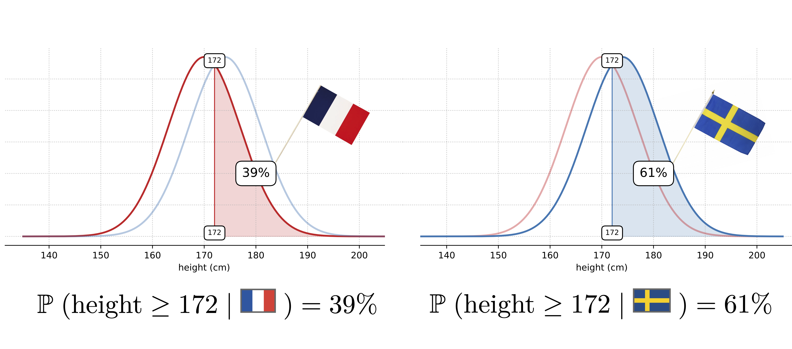
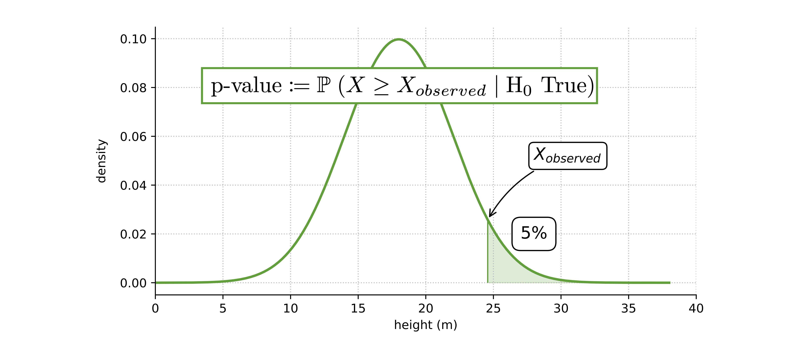
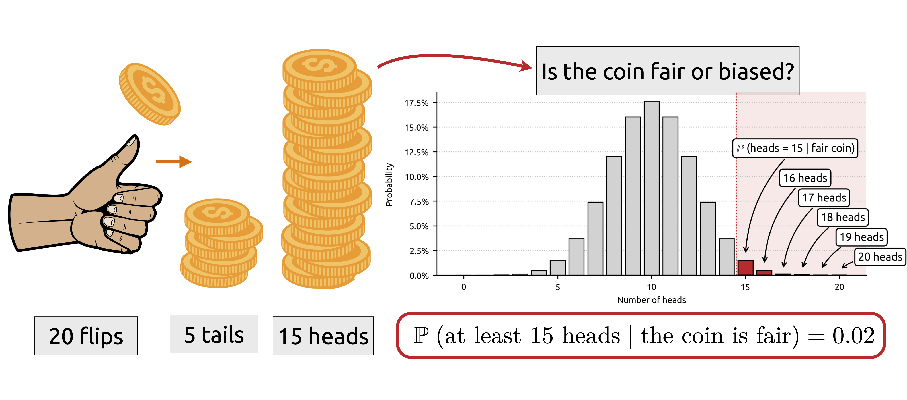
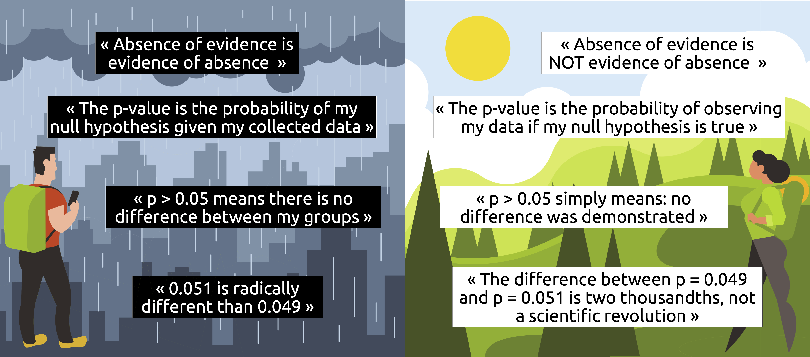

# The p-value


The p-value, interactively demystified.

You've heard about the _p-value_ more times than you can count, and always wondered what it's really
all about? Your wish is about to come true! This repository is made for you. Join me on a journey
into the world of mathematics to demystify, once and for all, what the famous p-value actually is.

Available at: [https://tcoustillet.github.io/the-pvalue](https://tcoustillet.github.io/the-pvalue)

## Preview

#### Probability Refresher &mdash; for those who want to start off on the right foot



#### Introduction to the p-value &mdash; for those who want to understand the fundamentals



#### The p-value in action &mdash; for those who prefer concrete examples



#### Beyond the p-value &mdash; for those who don’t want to get tripped up



## Deployment

Hosted via **Github Pages** &mdash; any change pushed to `main` goes live automatically

## Project structure

```
.
├── README.md
├── beyond-pvalue
├── content
├── css
├── examples-in-action
├── index.html
├── introduction
├── js
├── probability
├── pvalue-in-the-lab
└── statistical-tests
```
